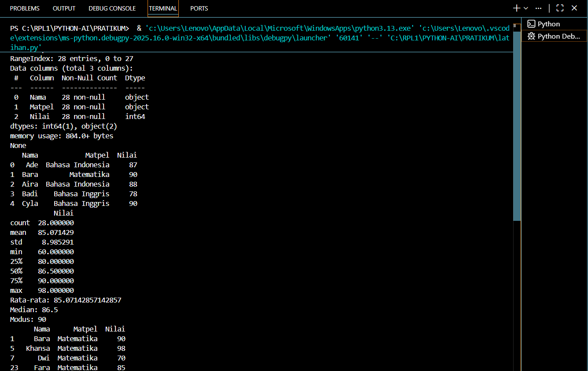
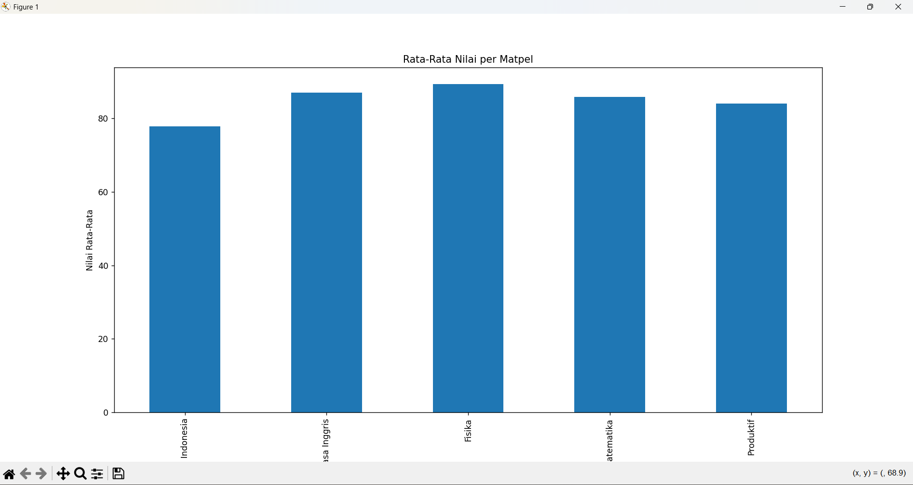
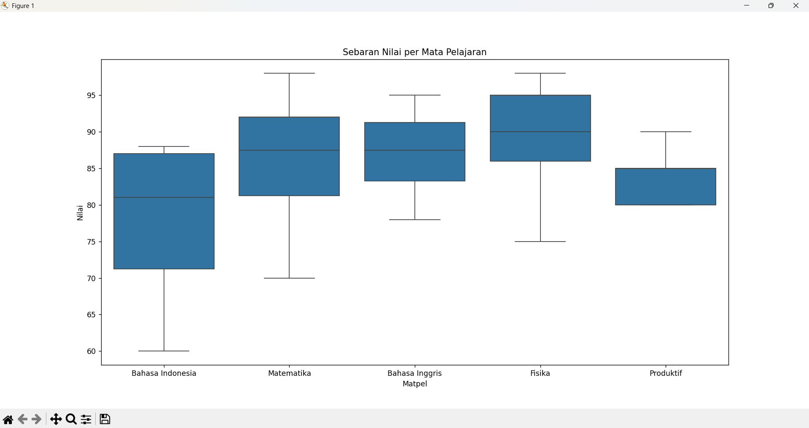

# 📊 Analisis Nilai Mata Pelajaran

Berikut adalah ringkasan hasil analisis data nilai beberapa mata pelajaran beserta interpretasinya.

## 1️⃣ Mapel dengan Rata-Rata Nilai Tertinggi
✨ **Fisika** menempati posisi tertinggi berdasarkan hasil perhitungan rata-rata nilai seluruh siswa.  

## 2️⃣ Mapel dengan Nilai Terendah
✨ **Bahasa Indonesia** menempati posisi terendah berdasarkan hasil perhitungan rata-rata nilai seluruh siswa.  

## 3️⃣ Peran Visualisasi dalam Memahami Data
✨ **Visualisasi sangat membantu dalam memahami data karena:**

- Mengubah angka menjadi bentuk grafik sehingga lebih mudah dibaca.  
- Memudahkan perbandingan antar mapel secara cepat.  
- Menampilkan pola, tren, dan anomali yang tidak terlihat hanya dari tabel angka.  
- Membuat analisis lebih intuitif dan menarik untuk dipelajari.

# 📝 Refleksi Siswa
## 1. Apa hal baru yang kamu pelajari dari kegiatan analisis dan visualisasi data?
Saya dapat belajar bagaimana mengolah angka menjadi informasi yang lebih bermakna dan kreatif, serta memahami cara kerja grafik dalam menampilkan pola data.

## 2. Kesulitan apa yang kamu alami dalam membuat grafik?
Kesulitan yang saya alami adalah menentukan jenis grafik yang tepat dan mengatur tampilan grafik agar mudah dibaca dan tidak membingungkan.

## 3. Menurut kamu apakah AI membantu dalam analisis sebuah data?
Iya, AI sangat membantu dalam menganalisis data karena dapat:
- ⚡ Mempercepat proses perhitungan  
- 📊 Menghasilkan visualisasi secara otomatis  
- 🤖 Memberikan wawasan atau pola yang mungkin tidak terlihat secara manual  

---
## Dokumentasi Hasil Pratikum Analisis Data

### Berikut adalah hasil output nilai pada terminal:

### Berikut adalah grafik untuk menampilkan rata rata nilai per mata pelajaran:

### Berikut adalah grafik untuk menampilkan sebaran nilai per mata pelajaran:

✨ *python XI RPL 1*